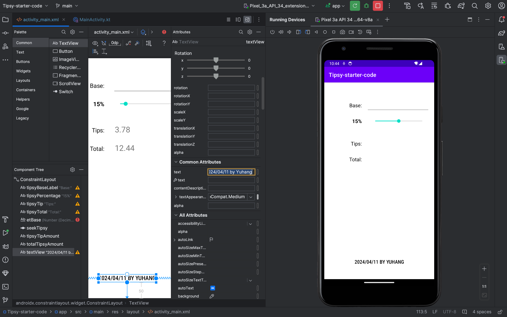
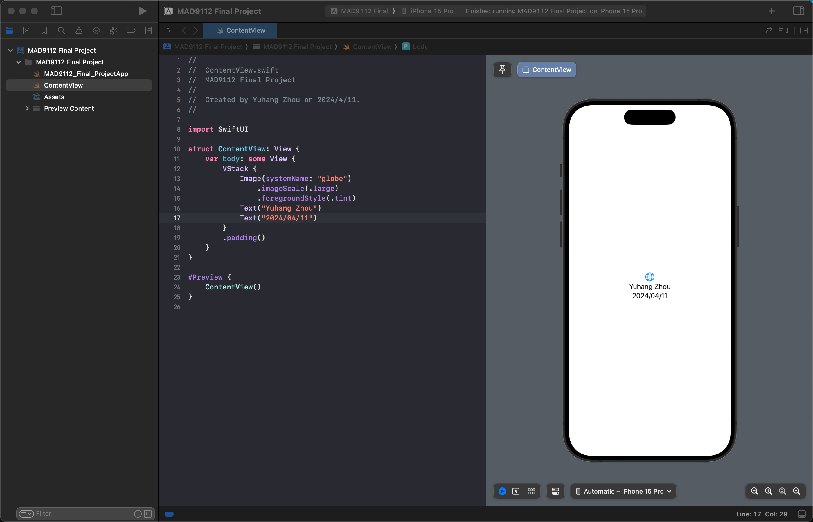

# Yuhang Zhou | zhou0244

## Topic 2

<code>
const participant = "Adesh";
const weight = 90;
const height = 1.91;
const categoryBMI = ["Underweight", "Normal weight", "Overweight", "Obese"];
let BMI;
function calculateBMI(weight, height) {
BMI = weight / height / height;
return BMI.toFixed(2);
}
calculateBMI(weight, height);
function interpretBMI(BMI) {
console.log(`${participant}'s BMI is "${calculateBMI(weight, height)}"`);
if (BMI < 18.5) {
console.log(`${participant} is "${categoryBMI[0]}".`);
} else if (BMI >= 18.5 && BMI < 25) {
console.log(`${participant} is "${categoryBMI[1]}".`);
} else if (BMI >= 25 && BMI < 30) {
console.log(`${participant} is "${categoryBMI[2]}".`);
} else {
console.log(`${participant} is "${categoryBMI[3]}".`);
}
}
interpretBMI(BMI);
</code>

## Topic 3

## Topic 4

## Topic 5

